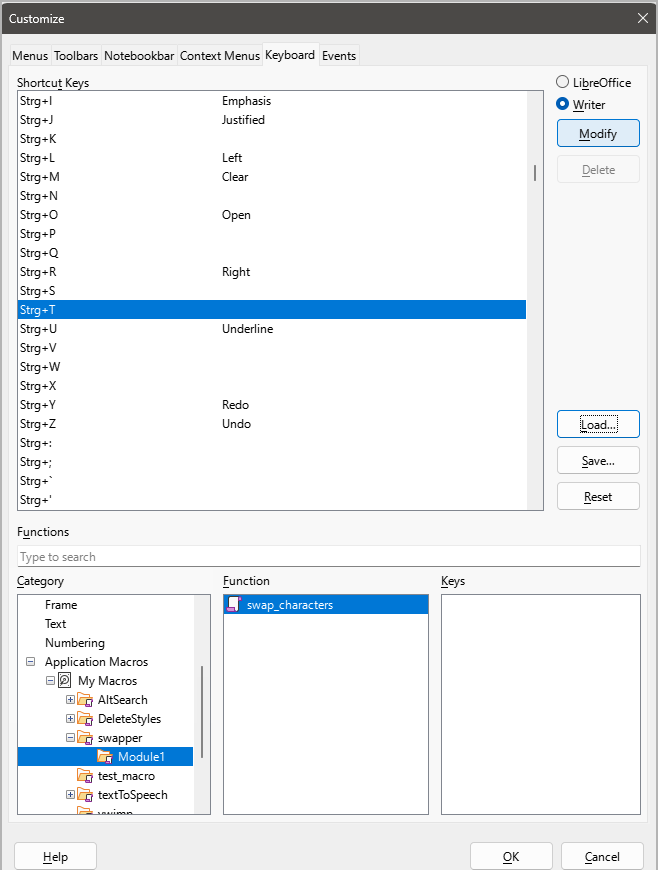

# swapper

An OpenOffice/LibreOffice Writer extension providing a macro that swaps two characters.

## Download link

[swapper-0.1.0.oxt](https://github.com/peter88213/swapper/raw/main/swapper-0.1.0.oxt)

## Set up

- Install the extension either via double-clicking
  on the downloaded file in the Windows Explorer, or using the
  OpenOffice/LibreOffice Extension Manager. 
- In *Writer*, go to **Tools > Customize** and assign a 
  keyboard shortcut to the "swap_characters" subroutine.
  
 

  > [!TIP]
  > Optionally create a menu entry or a toolbar button 
  > and assign it to the macro. 

## Usage

1. Place the cursor between the two characters to be swapped. 
2. Call up the macro, e.g. via the keyboard shortcut you assigned.
3. The two characters are swapped, and the cursor is moved one position to the right. 

## Get updates

This extension supports the update mechanism of OpenOffice and LibreOffice. 
You can let the Extension Manager check for updates from time to time to get the latest release.

## See also

- [StyleSwitcher](https://peter88213.github.io/StyleSwitcher/):
  Quickly switch between the style sheets of different document templates. 
- [curly](https://peter88213.github.io/curly/):
  Conversion of "curly quotes", 
  typographical apostrophes, ellipses and so on
  in several languages.
- [emph](https://peter88213.github.io/emph/):
  Use character styles instead of direct formatting to mark up text.

## Credits

[OpenOffice Extension Compiler](https://wiki.openoffice.org/wiki/Extensions_Packager#Extension_Compiler) by Bernard Marcelly.

## License

This extension is distributed under the [MIT License](http://www.opensource.org/licenses/mit-license.php).
 